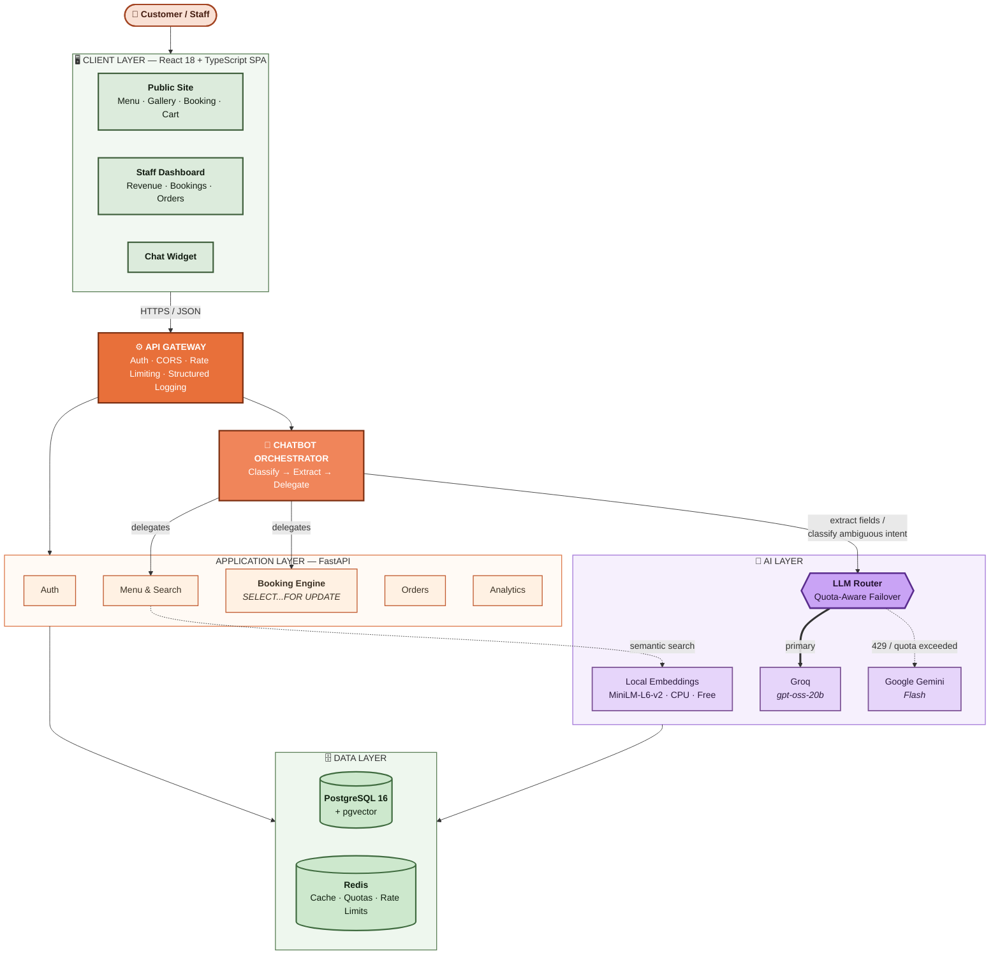

# CafeConnect

**A production-grade cafe management platform** — the digital front door for
customers and the operations backbone for the owner and staff, built entirely
on free and open-source technology.

---

## Overview

CafeConnect is a full-stack web application for an independent cafe that
unifies four things independent cafes normally run as disconnected tools: a
professional public website, live table booking (both a natural-language
chatbot and a manual picker), online ordering, and a real, data-backed
revenue dashboard for the owner.

It is built with a deliberate constraint: **zero mandatory recurring cost**
during development and low-volume production use. Every component — the
database, cache, embeddings model, and LLM providers — runs on a free tier or
is fully self-hosted, and the two LLM providers used for the booking
assistant are interchangeable so the system never depends on a single paid
vendor.

## Objectives

- Give customers a live, trustworthy view of table availability and the menu
  instead of a phone call or a walk-in guess.
- Let a customer book a table, browse the menu, and place an order in one
  continuous flow — with or without talking to a chatbot.
- Give the owner a genuine, real-time revenue and operations dashboard backed
  by live data, not a spreadsheet or intuition.
- Build the AI booking assistant to use the **minimum possible number of LLM
  tokens per conversation**, so it stays fast and free-tier-viable at real
  cafe traffic volumes.
- Make every mutating action — a booking, an order, a role check — provably
  correct under concurrency and under adversarial input, not just correct in
  the happy path.

## What We Built

| Area | Capability |
|---|---|
| **Public website** | Home, ambience gallery, full menu with semantic search, brand story, location & hours, and a booking page — all reading from live data, no placeholder content |
| **Accounts** | JWT auth with short-lived access tokens, rotating refresh tokens, and role-based access control (`customer` / `staff_admin`) |
| **Table booking** | A visual availability picker *and* a chatbot entry point, both backed by the same race-safe booking engine |
| **Booking chatbot** | Local-first intent classification (regex + embedding similarity) with an LLM used only for structured field extraction — at most one or two small model calls per completed booking |
| **LLM failover** | Groq (primary) and Google Gemini (secondary) behind a Redis-backed quota tracker that switches providers *before* hitting a rate limit, not after |
| **Online ordering** | Cart → checkout → live order-status tracking, with all pricing and availability validated server-side |
| **Staff dashboard** | Real-time revenue, best-sellers, table utilization/peak-hours, and booking-to-order conversion — every number computed at the database level, with seed/demo data always excluded |
| **Security hardening** | Production startup refuses to boot on a weak JWT secret, all secrets are environment-driven, every staff-only route is role-gated, rate limiting on auth and chat, structured JSON request logging |

## How It Helps

An independent cafe today typically runs on a static Instagram page for
ambience, phone calls for bookings, a separate POS for orders, and a
notebook for revenue tracking. That produces four concrete, recurring
problems, and CafeConnect exists to remove each one directly:

- **Turned-away customers** — nobody can see real table availability before
  they call or walk in. CafeConnect exposes the same live seating chart to
  the customer that the staff dashboard shows internally.
- **Fragmented booking and ordering** — a customer can browse the menu,
  check availability, book, and order without leaving one flow.
- **Decisions made on intuition** — the dashboard answers "what sold today,"
  "which tables sit empty," and "did that booking turn into revenue" from
  real transactions, not guesses.
- **AI that gets expensive at scale** — a naively built chatbot that resends
  full conversation history to a paid LLM on every turn breaks a small
  business's margins the moment traffic grows. This system classifies intent
  and retrieves menu matches locally first, and only calls an LLM for the one
  step that genuinely needs language understanding — extracting a date, time,
  and party size from a free-text sentence.

## Architecture

CafeConnect is a conventional three-tier system with one twist: the chatbot
is not a separate service — it is a thin orchestration layer that calls the
*same* booking, menu, and order services the REST API uses, so a booking made
through conversation and a booking made by clicking a time slot are
guaranteed to behave identically under concurrency.



**Reading the diagram:** every request — from the public site, the staff
dashboard, or the chat widget — passes through the same gateway (auth, CORS,
rate limiting, logging) before reaching a domain service. The chatbot never
talks to the database directly; it calls the identical `Booking Engine` and
`Menu & Search` services the REST API uses, which is what guarantees a
chatbot-made booking and a click-made booking are equally safe under
concurrency. The LLM Router only enters the picture for the one step that
needs language understanding (extracting structured fields from free text,
or classifying a genuinely ambiguous message); every other chatbot turn — a
menu question, small talk, a direct availability check — is answered from
Postgres and the local embedding model with no external API call at all.

## Tech Stack

| Layer | Technology |
|---|---|
| Backend | Python 3.12, FastAPI, SQLAlchemy 2.x (async), Alembic, Pydantic v2 |
| Database | PostgreSQL 16 with `pgvector` for semantic search |
| Cache / Queues | Redis — rate limiting, refresh-token allowlist, LLM quota tracking |
| AI / NLP | `sentence-transformers/all-MiniLM-L6-v2` (local, free) for embeddings; Groq (`gpt-oss-20b`) and Google Gemini (Flash) for LLM calls |
| Frontend | React 18, TypeScript, Vite, Tailwind CSS v4, React Router, TanStack Query, Zustand, Framer Motion, Recharts |
| Auth | JWT (access + refresh), bcrypt password hashing, role-based access control |
| Testing | pytest + pytest-asyncio (backend), Vitest + React Testing Library (frontend) |
| Infra | Docker Compose (Postgres, Redis, backend), GitHub Actions CI |

## Project Structure

```
cafeconnect/
├── backend/                  FastAPI application
│   ├── app/
│   │   ├── api/               Route handlers (one module per resource)
│   │   ├── core/               Config, security, JWT, logging, LLM router
│   │   ├── models/             SQLAlchemy ORM models
│   │   ├── schemas/            Pydantic request/response schemas
│   │   └── services/           Business logic shared by the API and the chatbot
│   ├── alembic/                 Database migrations
│   ├── scripts/                 One-off scripts (e.g. seeding)
│   └── tests/                    pytest suite
├── frontend/                  React + Vite application
│   └── src/
│       ├── components/          Layout, chat widget, dashboard widgets, UI primitives
│       ├── pages/                 Route-level pages
│       ├── hooks/                  React Query hooks per resource
│       ├── store/                   Zustand stores (auth, cart)
│       └── lib/                      API client, image assets
├── docker-compose.yml         Local Postgres + Redis + backend
├── DEPLOYMENT.md               Free-tier deployment guide (Render/Vercel/Supabase/Upstash)
└── cafe_management_system_plan.md   The end-to-end phase-by-phase project plan
```

## Getting Started

### Prerequisites

- Docker Desktop (for Postgres and Redis)
- Python 3.12+
- Node.js 20+

### Local setup

```bash
# 1. Copy and fill in environment variables
cp .env.example .env

# 2. Start Postgres (with pgvector) and Redis
docker compose up -d postgres redis

# 3. Backend: install, migrate, seed
cd backend
pip install -e ".[dev]"
alembic upgrade head
python -m scripts.seed        # creates a default staff admin, tables, and 30 days of slots
uvicorn app.main:app --reload

# 4. Frontend, in a second terminal
cd frontend
npm install
npm run dev
```

The frontend runs at `http://localhost:5173`, the backend at
`http://localhost:8000`. Interactive API documentation is available at
`http://localhost:8000/docs` (FastAPI's built-in Swagger UI).

## Environment Variables

See `.env.example` for the full, authoritative list. The essentials:

| Variable | Purpose |
|---|---|
| `DATABASE_URL` | Async Postgres connection string (`postgresql+asyncpg://...`) |
| `REDIS_URL` | Redis connection string |
| `JWT_SECRET` | Signing key for access/refresh tokens — **the app refuses to start in production (`ENV=production`) with a default or short value** |
| `GROQ_API_KEY` / `GEMINI_API_KEY` | LLM provider keys (both optional in development; the chatbot degrades gracefully to "please call the cafe" if both are unset or exhausted) |
| `FRONTEND_ORIGIN` | Exact origin allowed by CORS |
| `ENV` | `development` or `production` — gates the JWT secret check above |

## Running Tests

```bash
# Backend (spins up against the DATABASE_URL/REDIS_URL in the environment)
cd backend
pytest -v

# Frontend
cd frontend
npm run test
```

The backend suite includes concurrency tests that fire simultaneous booking
requests at the same table slot and assert exactly one succeeds — both
through the REST API and through the chatbot — and mocked-provider tests for
the LLM failover path. The frontend suite covers the booking flow, the
cart/checkout flow, and auth-guarded routing.

## The LLM Token-Minimization Strategy

This is the part of the system most likely to regress if a future change
isn't careful, so it's documented explicitly:

1. **Classify locally first.** Every chat message is checked against a
   regex/keyword layer, then — only if that's inconclusive — against a fixed
   set of labeled example utterances using the same local embedding model
   already used for menu search. An LLM is called to classify intent only
   when both of those are ambiguous.
2. **Never send the LLM the menu.** Menu questions are answered by the
   `pgvector` semantic search endpoint and returned directly; an LLM is never
   shown the menu contents.
3. **The LLM only extracts structured fields.** For a booking, the model's
   only job is turning free text into `{date, time, party_size,
   table_preference}` JSON in a single, small, capped-output call. It never
   decides whether a table is free — that is always a direct database check.
4. **No conversation history is resent.** Each session keeps a short rolling
   summary rather than the full transcript.
5. **Provider failover is proactive, not reactive.** A Redis counter tracks
   calls per provider per minute; the router switches to the secondary
   provider *before* hitting the limit, and falls back to a plain "please
   call the cafe" message if both providers are genuinely unavailable —
   the chatbot never hard-fails a conversation.

Net effect: a full booking — check availability, extract details, confirm —
typically completes in **at most one or two small LLM calls**, and a large
share of conversations (menu questions, small talk, direct availability
checks with an unambiguous request) complete with **zero** LLM calls.

## Security

- Every secret (`JWT_SECRET`, DB/Redis URLs, LLM API keys) is environment-variable driven — none are hardcoded.
- The application **refuses to start** in production with a missing or weak `JWT_SECRET`.
- All database access goes through the SQLAlchemy ORM — no raw string-built SQL anywhere in the codebase.
- Every staff-only endpoint is gated by an explicit role-check dependency, verified by automated tests that assert a customer token gets `403` on all of them.
- Passwords are hashed with bcrypt; JWTs are verified against a single, explicit algorithm (no algorithm-confusion surface).
- Rate limiting (Redis-backed, survives restarts) on login, registration, and the chat endpoint.
- CORS is locked to a single, explicit configured origin — never a wildcard.
- Structured JSON request logging (request id, user id, latency, and — for chat — which LLM provider served each turn) to stdout, compatible with any free-tier host's log aggregation.

## Deployment

Deployment is documented in full in **[DEPLOYMENT.md](DEPLOYMENT.md)**:
Postgres + pgvector on Supabase/Neon, Redis on Upstash, the backend on
Render/Railway via the included `Dockerfile`, and the frontend on
Vercel/Netlify — all free-tier. Actual deployment requires the project
owner's own hosting accounts and is not something performed on their behalf.

## Project Status

Built phase-by-phase against the plan in
[`cafe_management_system_plan.md`](cafe_management_system_plan.md):

| Phase | Status |
|---|---|
| 0–1 — Architecture, schema, migrations | ✅ Done |
| 2 — Authentication & authorization | ✅ Done |
| 3 — Menu, tables, and availability APIs | ✅ Done |
| 4 — Booking chatbot | ✅ Done |
| 5 — Online ordering | ✅ Done |
| 6 — Public-facing frontend | ✅ Done |
| 7 — Revenue & operations dashboard | ✅ Done |
| 8 — Security hardening, testing, deployment prep | ✅ Done |
| 9 — Documentation & handover | 🔶 This README only, by request — per-package READMEs and a changelog are deferred |
